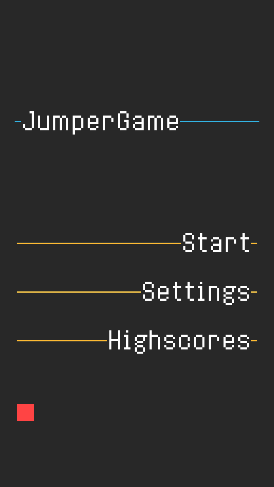
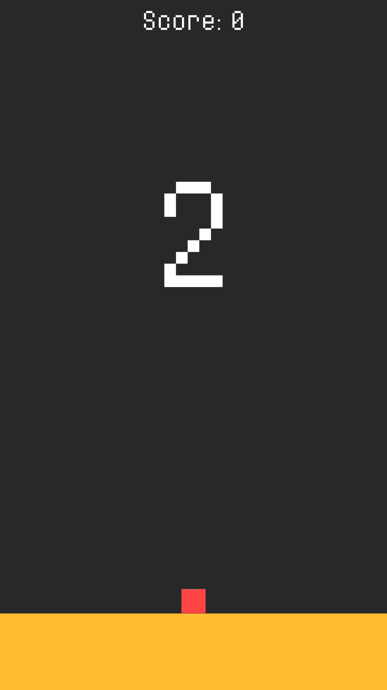
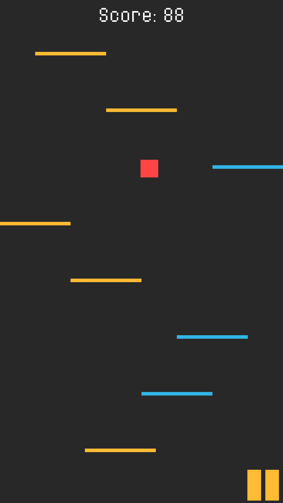
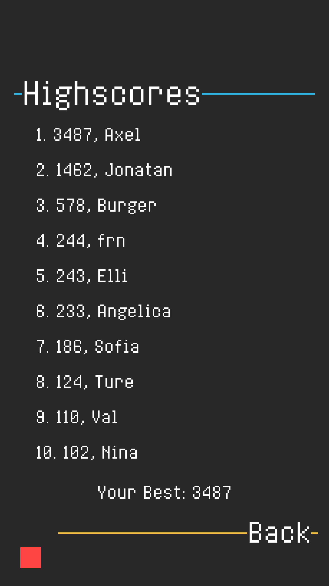

# JumperGame
This is a infinite jumper game. The theme idea is 8-bit graphics and sound. It is made using Unity and written in C#. The main platform for the game is mobile, both android and iOS, using the gyroscope accelerometer for controls.

Developed by Axel Lindeberg and Jonatan Cerwall. Music by Pontus Mjöberg.

#### Screenshots
|                |                |
| :------------- | :------------- |
| |  |
 |  |

#### How to install
For android the process is quite easy. Simply download the [apk here](https://github.com/AxlLind/2D-platformer/raw/master/JumperGame.apk) and open the file on your phone.

Since we do not have an apple developer license we cannot distribute an iOS version of this project.

#### Testing Strategy
Since we are using unity in this project we are continually testing everything we do. Doing traditional Unit Testing is not optimal for this kind of project, since the methods we write all work within Unity's physics and graphics engine. Our testing will still be extensive, but will consist of us playing the game (and possibly outside testers).

### Project plan
Our workflow consists of first creating a milestone in github for larger features, for example a basic UI. In a milestone we then create issues with smaller features contained in the overall milestone, in this example it might be a mute button for the pause screen.

As we notice bugs and missing features we also create issues for those that we fix when we can. For now what we have in mind in terms of features to implement are:

- Different types of platforms, for example moving platforms and trampolines
- Improve UI and graphics with nicer looking sprites
- Add features to UI such as being able to mute audio
- A global highscore list, implemented using a firebase database
